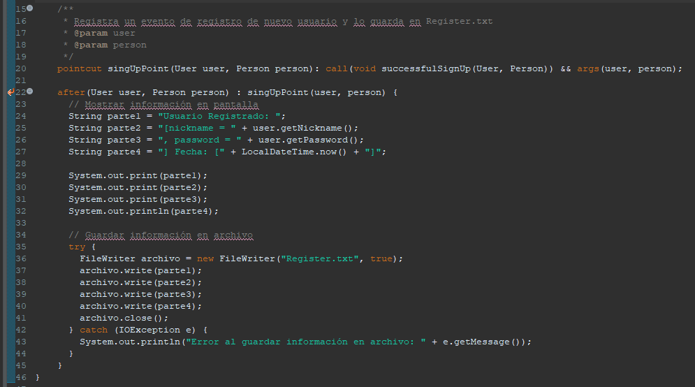
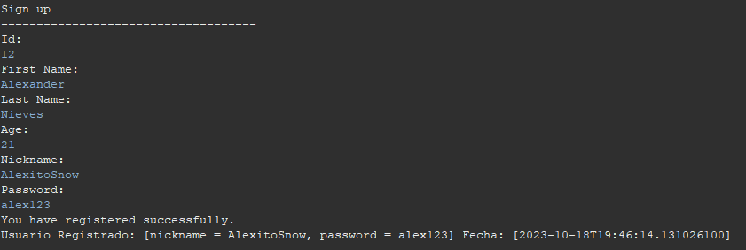
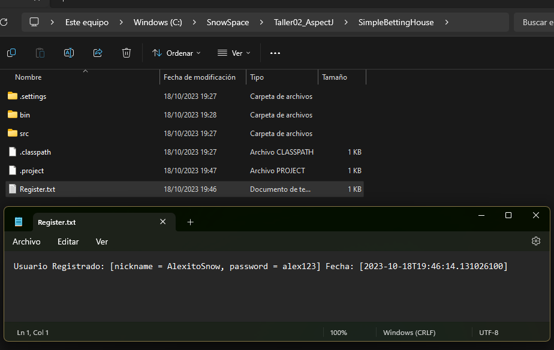

# Taller02_AspectJ

## Descargando Eclipse

## Instalando apsectj

## Importando proyecto

## Convirtiendo a proyecto AspectJ 

## Aspecto del Registro

### Código del aspecto:

### Por consola:

### Documento Register.txt

## Documento Log.txt

